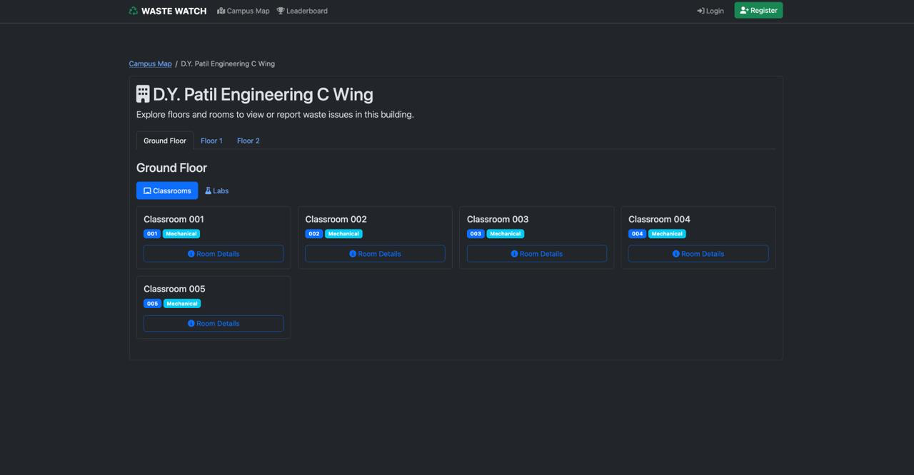
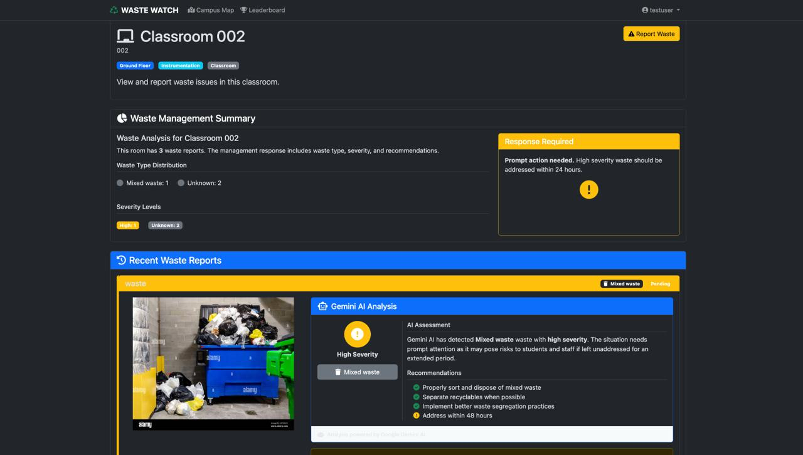

## Waste Watch Campus - AI-Powered Campus Waste Management System

A comprehensive Flask-based web application for managing waste reports across D.Y. Patil Campus using AI-powered image analysis with Google Gemini.  

###  Overview

Waste Watch Campus enables students, teachers, and cleaning staff to report, track, and manage waste issues across multiple campus buildings. The system uses Google's Gemini AI to automatically classify waste types and assess severity levels from uploaded images.

✨ Features
Core Functionality

    Interactive Campus Map: Navigate through buildings, floors, and rooms
    AI-Powered Analysis: Automatic waste classification and severity assessment using Gemini AI
    Multi-User System: Support for students, teachers, and cleaning staff
    Real-time Reporting: Submit waste reports with up to 5 images
    Department Leaderboard: Track waste reporting across departments and colleges
    Status Management: Cleaning staff can update report statuses

AI Integration

    Automatic waste type detection (Paper, Plastic, E-waste, Food waste, Hazardous, Mixed)
    Severity assessment (Critical, High, Medium, Low)
    Image analysis with detailed recommendations
    Fallback text parsing for robust classification

Architecture  

    Backend: Flask (Python)
    Database: SQLAlchemy (SQLite)
    AI: Google Gemini API
    Frontend: Bootstrap 5, jQuery
    Authentication: Flask-Login
    Forms: Flask-WTF

Project Structure
```
├── app.py                 # Main application entry point
├── models.py              # Database models
├── forms.py               # WTForms definitions
├── routes/                # Route blueprints
│   ├── auth.py           # Authentication routes
│   ├── main.py           # Main campus navigation
│   ├── report.py         # Waste reporting
│   └── leaderboard.py    # Department rankings
├── services/
│   ├── campus_service.py # Campus initialization
│   └── llm_service.py    # Gemini AI integration
├── templates/             # Jinja2 templates
├── static/
│   ├── css/
│   ├── js/
│   └── uploads/          # User-uploaded images
└── utils.py              # Helper functions
```

Screenshots  

- Home Page

- Building View

- Waste Report Form
